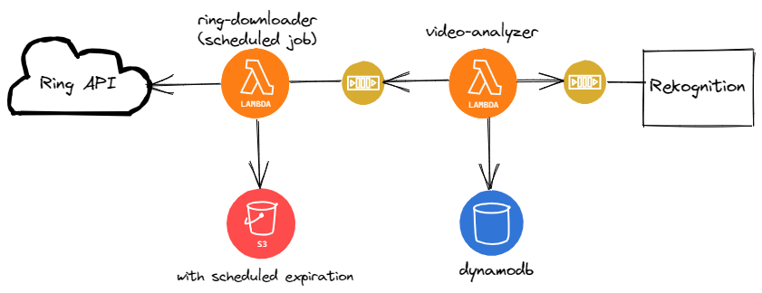

# video-analyzer
Analyzes video files using [Amazon's Rekognition](https://aws.amazon.com/rekognition/) and saves results in [DynamoDb](https://aws.amazon.com/dynamodb/). Currently the app only does [label detection](https://docs.aws.amazon.com/rekognition/latest/dg/labels.html).

The video-analyzer is a lambda function that is triggered by an sqs message from [ring-downloader](https://github.com/sharathgopinath/ring-downloader) containing the s3 file path of the video that is to be analyzed. An asynchronous Rekognition job is then triggered and the results published on an sns topic which is polled by video-analyzer. Once the results are available it is saved in dynamodb.



## Access patterns

The dynamodb is designed for the following access patterns - 
* Retrieve label names for a given year / month / day
* Retrive properties of specific labels for a given year / month / day 

## Sample analysis data
### Label names
```
{
  "PK": {
    "S": "label:2021"
  },
  "SK": {
    "S": "8:30"
  },
  "label_names": {
    "SS": [
      "Apparel",
      "Architecture",
      "Automobile",
      "Backyard",
      "Balcony"
    ]
  }
}
```

### Label properties
```
{
 "PK": "label:Person:2021",
 "SK": "8:28:front_cam",
 "analysis_response": [
  {
   "name": "Person",
   "instances": [
    {
     "Confidence": 98.52984619140625,
     "BoundingBox": {
      "Height": 0.3622591495513916,
      "Left": 0.36070266366004944,
      "Top": 0.46451959013938904,
      "Width": 0.10082066804170609
     }
    }
   ],
   "confidence": 98.85364532470703,
   "parents": [],
   "timestamp": 3000
  }
}
```

## Run tests
```
docker-compose up -d
python3 -m pytest
```

## References
* https://docs.aws.amazon.com/code-samples/latest/catalog/code-catalog-python-example_code-rekognition.html
* https://boto3.amazonaws.com/v1/documentation/api/latest/index.html
* https://www.alexdebrie.com/posts/dynamodb-single-table/
